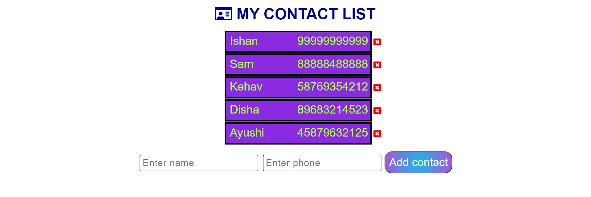

## Screenshots

## Technologies Stack:

### Components
- Node.js,Express.js,EJS
- Javascript
- Css

### Insights
- used Express to make a simple Contact List
- used Ejs for front end
- Can add contacts
- Can delete contacts

### How to install
- Clone the project onto your local machine.
- Then cd SocialBe-App
- globally install and set mongodb
- npm install to install dependencies
- globally install nodemon
- nodemon index.js (run server in development mode)
- Visit your app at http://localhost:8000